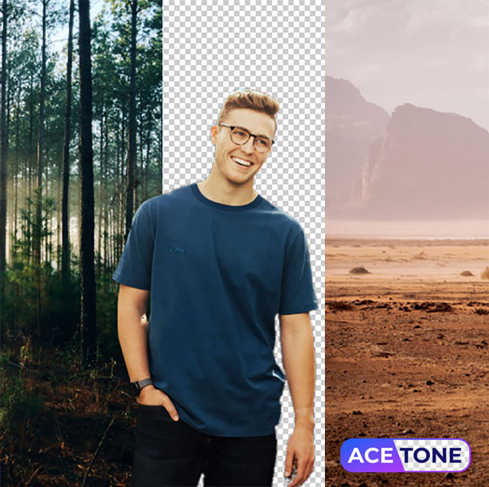

# API PHP Client for AceTone.AI

You can programmatically remove backgrounds from your images using the API of AceTone.AI. 
Also you can fill background by solid color, by gradient or radial gradient. Or you can replace background by other image. 

**IMPORTANT:** You need register an account and obtain your API key on the https://acetone.ai/



## Installation

Install via composer

```
composer require avadim/acetone-api-php
```

## Quick Start

```php
use avadim\Acetone\AcetoneApi;

$acetone = new AcetoneApi($apiKey);
$acetone->fromFile($sourceImageFile)->save($targetImageFile);

```

## Advanced Usage

### Sources

The image can be obtained from a link, from a file, from a binary string, or from a base64-string 

```php
// Get source image from URL
$acetone->fromUrl($imageUrl)->save($outFile);

// Get source image from file
$acetone->fromFile($imageFile)->save($outFile);

// Get image from binary string
$imageString = file_get_contents($fileName);
$acetone->fromString($imageString)->save($outFile);

// Get image as a base64-string
$base64 = get_image_base64();
$acetone->fromBase64($base64)->save($outFile);

```

### Manipulations With Background 

```php
// Just remove background
$acetone->fromFile($imageUrl)->bgRemove()->save($outFile);

// Set background color
$acetone->fromFile($imageUrl)->bgColor('f00')->save($outFile);
$acetone->fromFile($imageUrl)->bgColor('#f00')->save($outFile);
$acetone->fromFile($imageUrl)->bgColor([255,0,0])->save($outFile);

// Fill background by a linear gradient
$colors = ['f00', '33c'];
$vector = -30;
$acetone->fromFile($imageUrl)->bgRadialGradient($colors, $vector)->save($outFile);

// Fill background by a radial gradient
$colors = ['f00', '33c'];
$center = [120, 240];
$acetone->fromFile($imageUrl)->bgGradient($colors, $center)->save($outFile);

// Set grayscale mode of background
$acetone->fromFile($imageUrl)->bgGrayscale()->save($outFile);

// Set background image from binary string
$bgImageFile = 'path/to/new/background';
$bgImage = file_get_contents($bgImageFile);
$acetone->fromFile($imageUrl)->bgImage($bgImage)->save($outFile);

// Or set background image from file
$bgImageFile = 'path/to/new/background';
$acetone->fromFile($imageUrl)->bgImageFile($bgImage)->save($outFile);

```

### Resize Result Image

```php
$acetone->fromFile($imageFile)
    ->size(800, 600, AcetoneApi::IMG_FIT_COVER, AcetoneApi::IMG_FIT_COVER)
    ->bgImageFile($imageFileBg)
    ->save($outFile);
```

### Crop Result Image to Foreground Fit
```php
$acetone->fromFile($imageFile)
    ->crop()
    ->get();
```

### Get Result Image as a Binary String 

```php
// You can define output format - png, jpg or webp (png is default)
$imageStr = $acetone->fromFile($imageFile)->get('webp');
$image = imagecreatefromstring($imageStr);
// Some manipulations
imagejpeg($im, 'image.jpg');
```


