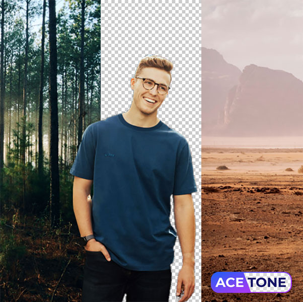

# PHP-клиент для API AceTone.ai

[English](README.en.md) | **Русский**

С помощью API AceTone.ai можно программно удалять фон с изображений. Также фон можно
залить сплошным цветом, линейным или радиальным градиентом, размыть или обесцветить,
либо заменить другим изображением. Кроме того, клиент поддерживает удаление объектов по
маске и улучшение/апскейл изображения.

**ВАЖНО:** Нужно зарегистрировать аккаунт и получить API-ключ на https://acetone.ai/



## Установка

Установка через composer

```
composer require acetonesoft/acetone-api-php
```

Требуется PHP >= 7.4 и зависимость `guzzlehttp/guzzle`.

## Быстрый старт

```php
use AcetoneSoft\Acetone\AcetoneApi;

$acetone = new AcetoneApi($apiKey);
$acetone->fromFile($sourceImageFile)->save($targetImageFile);
```

## Два стиля API

Клиент предоставляет два взаимозаменяемых стиля:

1. **Fluent-билдер** — задайте источник через `fromFile()` / `fromUrl()` / `fromString()` /
   `fromBase64()`, соедините цепочкой модификаторы, затем вызовите терминальный геттер
   (`get()` / `getObject()` / `getEnhanced()`) или сейвер (`save()` / `saveObject()` /
   `saveEnhanced()`).
2. **One-shot методы** — принимают исходное изображение как **бинарную строку** и возвращают
   результат тоже бинарной строкой (см. [One-shot методы](#one-shot-методы)).

HTTP-запрос не выполняется, пока не вызван терминальный геттер/сейвер.

## Расширенное использование

### Источники

Изображение можно получить по ссылке, из файла, из бинарной строки или из base64-строки.

```php
// Исходное изображение по URL
$acetone->fromUrl($imageUrl)->save($outFile);

// Исходное изображение из файла
$acetone->fromFile($imageFile)->save($outFile);

// Изображение из бинарной строки
$acetone->fromString($imageString)->save($outFile);

// Изображение из base64-строки
$acetone->fromBase64($base64)->save($outFile);
```

### Манипуляции с фоном

```php
// Просто удалить фон
$acetone->fromFile($imageFile)->bgRemove()->save($outFile);

// Задать цвет фона (hex с "#" или без, короткий hex либо RGB-массив)
$acetone->fromFile($imageFile)->bgColor('f00')->save($outFile);
$acetone->fromFile($imageFile)->bgColor('#f00')->save($outFile);
$acetone->fromFile($imageFile)->bgColor([255, 0, 0])->save($outFile);

// Залить фон линейным градиентом (второй аргумент — угол вектора градиента)
$colors = ['f00', '33c'];
$vector = -30;
$acetone->fromFile($imageFile)->bgGradient($colors, $vector)->save($outFile);

// Залить фон радиальным градиентом (второй аргумент — центр [x, y])
$colors = ['f00', '33c'];
$center = [120, 240];
$acetone->fromFile($imageFile)->bgRadialGradient($colors, $center)->save($outFile);

// Размыть фон (степень размытия)
$acetone->fromFile($imageFile)->bgBlur(20)->save($outFile);

// Обесцветить фон
$acetone->fromFile($imageFile)->bgGrayscale()->save($outFile);

// Задать фоновое изображение из бинарной строки
$bgImage = file_get_contents('path/to/new/background');
$acetone->fromFile($imageFile)->bgImage($bgImage)->save($outFile);

// Либо задать фоновое изображение из файла
$acetone->fromFile($imageFile)->bgImageFile('path/to/new/background')->save($outFile);
```

### Изменение размера результата

`size(width, height, $fgFit, $bgFit)`. Константы вписывания: `IMG_FIT_NONE`, `IMG_FIT_COVER`,
`IMG_FIT_CONTAIN`, `IMG_FIT_STRETCH`.

```php
$acetone->fromFile($imageFile)
    ->size(800, 600, AcetoneApi::IMG_FIT_COVER, AcetoneApi::IMG_FIT_COVER)
    ->bgImageFile($imageFileBg)
    ->save($outFile);
```

### Обрезка результата по границам объекта

```php
$acetone->fromFile($imageFile)
    ->crop()
    ->get();
```

### Качество вывода и точное вырезание

```php
// Задать качество (1-100) и включить режим точного вырезания
$acetone->fromFile($imageFile)
    ->quality(90)
    ->exact(true)
    ->save($outFile);
```

### Тень

```php
// Добавить падающую тень под объектом
// shadow(power, offsetX, offsetY, color) — цвет должен быть в hex-формате
$acetone->fromFile($imageFile)
    ->shadow(50, 15, 15, '#999999')
    ->save($outFile);
```

### Наложение логотипа

```php
// Наложить логотип из файла с «сырыми» опциями logo_*
$acetone->fromFile($imageFile)
    ->logoImageFile($logoFile, ['logo_position' => 0, 'logo_size' => 10, 'logo_opacity' => 1])
    ->save($outFile);

// Логотип из бинарной строки
$acetone->fromFile($imageFile)
    ->logoImage($logoBinary)
    ->save($outFile);
```

Поддерживаемые «сырые» опции логотипа: `logo_angle`, `logo_position`, `logo_opacity`,
`logo_size`, `logo_padding`, `logo_correct`.

### Удаление объекта

Удаление объекта, заданного маской (белое = удаляемая область).

```php
// Fluent-стиль — цвет заливки должен быть в hex-формате
$acetone->fromFile($imageFile)
    ->maskFile($maskFile)
    ->objectBgColor('#ffffff')
    ->saveObject($outFile);

// Маску можно передать и бинарной строкой
$acetone->fromFile($imageFile)
    ->mask(file_get_contents($maskFile))
    ->getObject('png');

// One-shot стиль (принимает бинарные строки)
$result = $acetone->objectRemove(
    file_get_contents($imageFile),
    file_get_contents($maskFile)
);
```

### Улучшение изображения

Улучшение/апскейл изображения. Опционально можно передать целевое изображение,
к которому подтягивать результат.

```php
// Fluent-стиль
$acetone->fromFile($imageFile)
    ->enhanceMode('solo')
    ->saveEnhanced($outFile);

// С целевым изображением (из файла или бинарной строки)
$acetone->fromFile($imageFile)
    ->targetImageFile($targetFile)
    ->saveEnhanced($outFile);

// One-shot стиль
$result = $acetone->enhanceImage(file_get_contents($imageFile));

// Получить результат бинарной строкой
$imageStr = $acetone->fromFile($imageFile)->getEnhanced('png');
```

### Результат в виде бинарной строки

```php
// Можно указать формат вывода — png, jpg или webp (по умолчанию png)
$imageStr = $acetone->fromFile($imageFile)->get('webp');
$im = imagecreatefromstring($imageStr);
// Какие-то манипуляции
imagejpeg($im, 'image.jpg');
```

### Произвольные опции API

Метод `options()` — «escape hatch» для передачи любых «сырых» параметров API, у которых нет
отдельного метода. Они мёржатся в query-string запроса.

```php
$acetone->fromFile($imageFile)
    ->options(['some_api_param' => 'value'])
    ->save($outFile);
```

### Время запроса

`getTime()` возвращает время выполнения (в секундах) последнего вызова API.

```php
$acetone->fromFile($imageFile)->save($outFile);
echo $acetone->getTime(); // например, 1.234
```

## One-shot методы

Принимают исходное изображение (и, где нужно, дополнительное изображение/маску) как
**бинарные строки** и возвращают результат бинарной строкой:

```php
$src = file_get_contents($imageFile);

$acetone->backgroundRemove($src);
$acetone->backgroundColor($src, '#ff0000');
$acetone->backgroundGradient($src, ['f00', '33c'], -30);        // линейный, угол вектора
$acetone->backgroundRadialGradient($src, ['f00', '33c'], [120, 240]); // радиальный, центр
$acetone->backgroundBlur($src, 20);
$acetone->backgroundGrayscale($src);
$acetone->backgroundImage($src, file_get_contents($bgFile));
$acetone->backgroundReplace($src, file_get_contents($bgFile));  // псевдоним backgroundImage
$acetone->objectRemove($src, file_get_contents($maskFile));
$acetone->enhanceImage($src);
```

Каждый one-shot метод дополнительно принимает завершающий массив `$options`,
который передаётся в `options()`.
